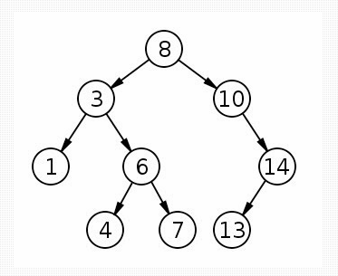

# JavaBinaryTree
Hey guys, 
this is my first application on binary tree with creation of roots and direct and left children.

## Class Diagram

## BinaryTree Example

©️ A Java application about the Binary Tree class at São Judas Tadeu University.
